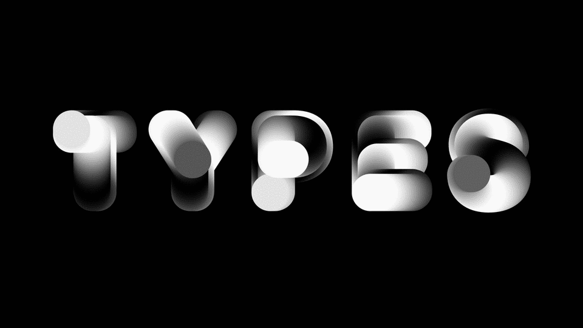

# Generative/Computational Typography

## Course information
- GD405
- 3 credits
- Spring 2018
- Instructor: [Dae In Chung](http://paperdove.com)
- email: [dchung01@mica.edu](mailto:dchung01@mica.edu)
- Office: BR303
- Office hours: Tue, Thu & Fridays - email for an appointment
- [Syllabus](files/MICA-18SP-GenType-Syllabus.pdf)

## General resources
- [Submit assignments here.](https://drive.google.com/drive/folders/11t0H6FQ7-p-8r-f7UgTzNdKfTzrla2VR?usp=sharing) - you don't need to request access. sign in with your MICA email account.
- [Computational typography resources Trello board](https://trello.com/b/1P0cgPsv/computational-typography-resources)

## Weekly
### Week 1
- [Survey](https://goo.gl/forms/RP3SSk7o9McPhvr53) - sign in with your MICA email account.
- [lecture](lectures/w1/lecture.md)
- [assignments](lectures/w1/w1-assignments.md)

<!--

### Week 2
- [Setting up a sketch](lectures/w2/setting-up-sketch.md)
- [Drawing basics](lectures/w2/drawing-basics.md) 
- [Advanced drawing](lectures/w2/drawing-advanced.md)
- [Type functions](lectures/w2/type-functions.md)
- [assignments](lectures/w2/w2-assignments.md)

### Week 3
- [Variables](lectures/w3/variables.md)
- [Arithmetic](lectures/w3/arithmetic.md)
- [Randomness](lectures/w3/randomness.md)
- [Type Setting - function and transformation](lectures/w3/type-setting.md)
- [assignments](lectures/w3/w3-assignments.md)

### Week 4
- [How to export to Image formats](lectures/w4/image-export.md)
- [How to export to SVG](lectures/w4/vector-export.md)
- [Conditionals](lectures/w4/conditionals.md)
- [Type Setting - page setting](lectures/w4/type-setting-conditionals.md)
- [assignments](lectures/w4/w4-assignments.md)

### Week 5
- [Converting p5 to Processing (Incomplete Guide)](lectures/w5/convert-p5-to-processing.md)
- Download [example files](files/pdf-saving-in-processing.zip) for saving PDF in Processing.
- Printing at [Art Tech Center](https://www.mica.edu/Academic_Services_and_Libraries/Technology_Systems_and_Services/Technology_Facilities/Art_Tech_Center.html)
- [assignments](lectures/w5/w5-assignments.md)

### Week 6
- Loops
- Pattern making basics: [examples](http://codepen.io/collection/AyaKxK/)
- [Typographic patterns](lectures/w6/type-patterns.md)
- [assignments](lectures/w6/w6-assignments.md)

### Week 7
- [Problems with your code?](lectures/w7/problem-solving-tips.md)
- [Motion](lectures/w7/motion.md)
- [Trigonometry](lectures/w7/trigonometry.md)
- [Interpolation](lectures/w7/interpolation.md)
- [assignments](lectures/w7/w7-assignments.md)

### Week 8
- [Objects](lectures/w8/object.md)
- [Glyph object](lectures/w8/object-glyph.md)
- [assignments](lectures/w8/w8-assignments.md)

### Week 9
*No class - Spring Break*

### Week 10
- Object review: [here](http://codepen.io/cdaein/pen/wJmMpp) and [here](http://codepen.io/cdaein/pen/QpmNOe)
- [assignments](lectures/w10/w10-assignments.md)

### Week 11
- Present the Interactive Type Poster
- [Array](lectures/w11/arrays.md)
- [Type Setting with Array](lectures/w11/array-type-setting.md)
- [Final project brief](lectures/w11/final-project.md)

### Week 12
- [assingments](lectures/w12/w12-assignments.md)

### Week 14

- [animation transition example](http://codepen.io/cdaein/pen/gWadZG)

-->
