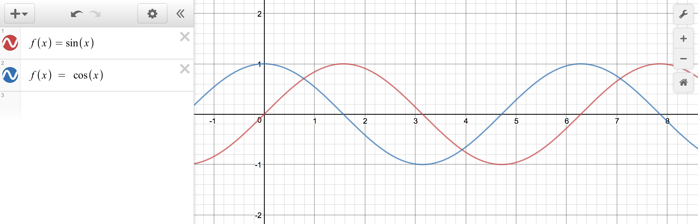

# Trigonometry

There are a lot of interesting things about trigonometry, but here, we will look at a few examples on how it can be used for creating organic movements.

## Sine / Cosine



The only thing you need to know now is that the value we get from the sine function changes smoothly between -1 and 1 as `x` or `angle` increases.

```java
float diam;
float angle;

void setup() {
  size(400, 400);
  
  diam = 20;
  angle = 0;
}

void draw() {
  background(200);
  
  ellipse(width/2, height/2, diam, diam);
  diam = sin(angle);
  angle += 0.01;
}
```
You won't see much here because the value will move between -1 and 1. So let's multiply some number to the sine function.

```js
diam = sin(angle) * 200;
```

And add some number to set the minimum value as well as to prevent getting the negative value.

```js
ellipse(width/2, height/2, diam, diam);
diam = 150 + sin(angle) * 100;
angle += 0.02;
```
We get almost breathing-like animation. `sin()` is great to make your animation more natural.


## Circular motion using trigonometry

```java
float xpos;
float ypos;
float diam;
float angle;

void setup() {
  size(400, 400);
  background(200);
  
  diam = 20;
  angle = 0;
}

void draw() {
  noStroke();
  fill(0);
  ellipse(xpos, ypos, 2, 2);
  
  xpos = width/2 + cos(angle) * 200;
  ypos = height/2 + sin(angle) * 200;
  angle += 0.03;
}
```

The value you add (`width/2` or `height/2`) will be the center point, the value you multiply (`200`) will be the diameter, and the amount of change (`angle`) is the speed of the circle. Now, you can think of these three values as something you can control.

```js
xpos = width/2 + cos(angle / 3) * width/2;
ypos = height/2 + sin(angle) * height/2;
angle += 0.03;
```


## Further learning
- [Processing trigonometry tutorial](https://processing.org/tutorials/trig/)
- [Lissajous curve](https://en.wikipedia.org/wiki/Lissajous_curve)
- Try graphing your motion first at http://desmos.com

