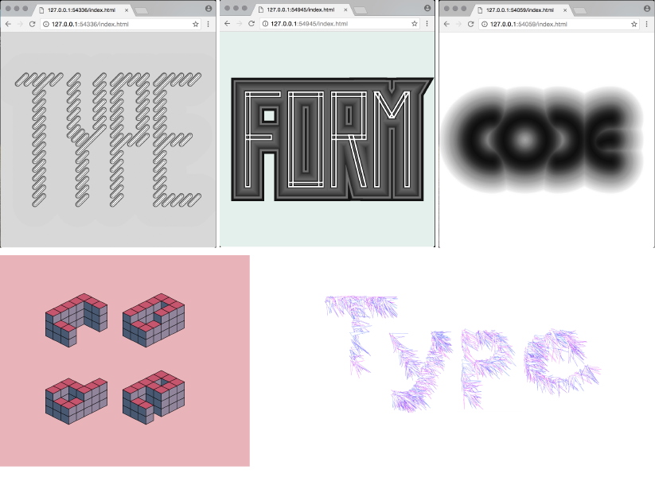

# Week 2 Assignments

## Drawing type
Design 3 words — type, form, and code — based on rules and conditions you set. Each word should employ different rules, therefore, they should be designed in different visual styles. Letters in each word should have some uniformity.

For example, one of the words may only use circles. Another one may only use diagonals. Another one may use lines emanating from the center, etc. But, don’t take these examples literally. Do your own experiments. 

We haven’t yet learned how to connect variables to control the form, but this should be one of the considerations while doing this assignment — how computational typography can be different from the more traditionally designed types. Our end goal is not to just design a set of typographic forms. It is to create a system with rules and variables that can respond to different conditions to generate different outcomes dynamically. What properties of your type design do you want to control to make it responsive or interactive?

### Inspirations 
  - Peter Cho’s [Type me, type me not](http://www.typotopo.com/projects.php?id=typemenot)
  - http://www.saic.edu/150/poster-generator/
  - http://paperdove.com/work/build-the-system.html
  - http://normalfutu.re/esthetics-of-variability/normaltypev154/
  - http://3st.com/work/exhibit-columbus#1
  - http://typecuts.com/projects.php?c=3&p=9
  - http://www.muirmcneil.com/projects/

### Deliverables
  - set each sketch size to 900 x 600 px.
  - you can use colors if you want, but keep *the background white*.
  - 3 different Processing sketches (folders) for each word. Note that (1) you have to upload the entire folder, not just `pde` file, (2) the folder and file must have the same name. 
  - Images(screen captures) of your design for each sketch. 
  - Post everything on Google Drive.

-----

## Video Lessons
Watch the videos listed below, and just like last time, take notes and bring back questions!
  - [3. Interactions](https://www.youtube.com/watch?v=o8dffrZ86gs&list=PLRqwX-V7Uu6by61pbhdvyEpIeymlmnXzD) (3 videos)
  - [4. Variables](https://www.youtube.com/watch?v=B-ycSR3ntik&list=PLRqwX-V7Uu6aFNOgoIMSbSYOkKNTo89uf) (4 videos)

-----
*All assignments are due at the beginning of next class. If your files are not ready, it will be marked late.*

