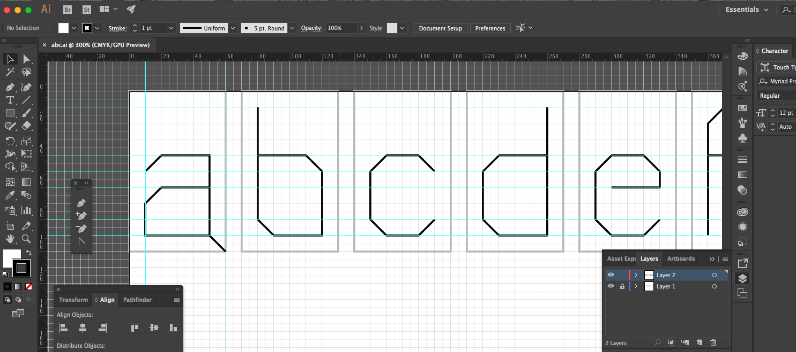
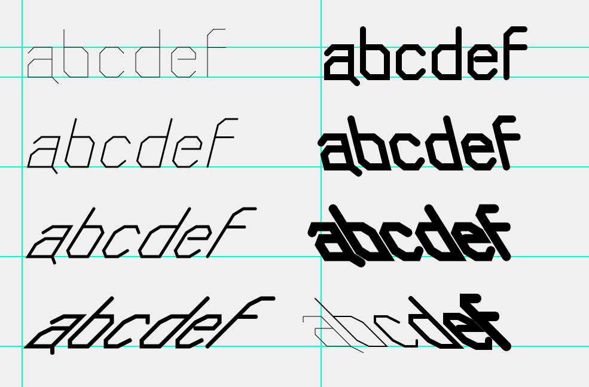

# Type Setting
Let's take a look at how we might set types -- arrange letters in space -- using code. 

## Design letterforms
First, you will need to have your letter design. Drawing directly with code is not very intuitive and easy to make mistakes, so it's best that you use the graph paper or digital tools like Adobe Illustrator. Here, I have an example of a few letters designed in Illustrator.




## Convert to code
Once you have your design set, you will convert it into p5 coordinates. You can either use the graph paper to help you determine the coordinates or use the existing tools to [convert SVG to Canvas code](http://www.professorcloud.com/svg-to-canvas/).

I already have done it, and here is the example code that we will use for this section.
```js
// b
beginShape();
vertex(10,10);
vertex(10,40);
vertex(10,80);
vertex(20,90);
vertex(50,90);
vertex(50,50);
vertex(40,40);
vertex(10,40);
endShape();

// c
beginShape();
vertex(120,50);
vertex(110,40);
vertex(90,40);
vertex(80,50);
vertex(80,80);
vertex(90,90);
vertex(110,90);
vertex(120,80);
endShape();

// d
beginShape();
vertex(190,10);
vertex(190,40);
vertex(190,90);
vertex(160,90);
vertex(150,80);
vertex(150,50);
vertex(160,40);
vertex(190,40);
endShape();
```
The code above will draw b, c and d. This is great if you wanted to just draw these three letters one after the other. But what if we wanted to form a different letter combinations? Everytime you add a letter on screen, you will have to reconfigure the coordinates of every vertex and that's not very efficient.

## Draw from the origin
First thing we can do is to remap the coordinates so every letter will be drawn from the origin like this:
```js
beginShape();
vertex(10,10);
vertex(10,40);
vertex(10,80);
vertex(20,90);
vertex(50,90);
vertex(50,50);
vertex(40,40);
vertex(10,40);
endShape();

beginShape();
vertex(50,50);
vertex(40,40);
vertex(20,40);
vertex(10,50);
vertex(10,80);
vertex(20,90);
vertex(40,90);
vertex(50,80);
endShape();

beginShape();
vertex(50,10);
vertex(50,40);
vertex(50,90);
vertex(20,90);
vertex(10,80);
vertex(10,50);
vertex(20,40);
vertex(50,40);
endShape();
}
```

## Use functions
The letters are now overlapping each other, but that is okay. We will only draw one letter at a time. Now, instead of having to copy ten lines of code everytime we want to add a letter, how about we turn each letter into its own function? Then, it becomes modular code blocks that can be resued multiple times.

```js
void drawB() {
  beginShape();
  vertex(10,10);
  vertex(10,40);
  vertex(10,80);
  vertex(20,90);
  vertex(50,90);
  vertex(50,50);
  vertex(40,40);
  vertex(10,40);
  endShape();
}

// repeat for other letters. drawC(), drawD(), ...
```
Now, instead of having to write long lines of code, we simply *call* a function to draw a letter as simple as below:
```js
void draw() {
  background(250);
  drawB();
}
```

## Adding parameters
Now, all the letters have their own functions, so we don't even need to look inside. We just need to call them when we need them. But, we have a problem. all the letters are drawn from the origin. We should be able to tell a function where we want the letter to be drawn. To do that, we will need to add parameters to the functions.

What we want to be able to do is to tell the function x and y coordinate so the letter will be drawn at that location. So, I am adding two parameters `x` and `y` to the function definition. Parameters are basically variables that work in a function. And when we *call* the function, we supply the proper values.

```js
void drawB(float x, float y) {
  beginShape();
  vertex(10,10);
  vertex(10,40);
  vertex(10,80);
  vertex(20,90);
  vertex(50,90);
  vertex(50,50);
  vertex(40,40);
  vertex(10,40);
  endShape();
}
```

We just created `x` and `y` parameters but we are not using them in any way. Let's go into the function and change a little bit. Basically, we want to use `x` and `y` to create some offset in drawing the letter. So, we can add `x` and `y` to each vertex as below:

```js
void drawB(float x, float y) {
  beginShape();
  vertex(10 + x,10 + y);
  vertex(10 + x,40 + y);
  vertex(10 + x,80 + y);
  vertex(20 + x,90 + y);
  vertex(50 + x,90 + y);
  vertex(50 + x,50 + y);
  vertex(40 + x,40 + y);
  vertex(10 + x,40 + y);
  endShape();
}
```
But, because every vertex has to be moved with the same amount of offset, there is a simpler way of doing this, using transformation.

## Tranformation
We will surround the drawing codes with `pushMatrix()` and `popMatrix()` block. This is to temporarily change the coordinate *system*, not individual points. `translate()` is similar to moving  positions, but note that we are actually moving the entire coordinate system. You can think of a canvas as a piece of paper, and anytime we use `pushMatrix()`, we are adding another sheet on top of that, and `popMatrix()` to remove that additional layer.

```js
void drawB(float x, float y) {
  pushMatrix();
  translate(x, y);
  beginShape();
  vertex(10,10);
  vertex(10,40);
  vertex(10,80);
  vertex(20,90);
  vertex(50,90);
  vertex(50,50);
  vertex(40,40);
  vertex(10,40);
  endShape();
  popMatrix();
}
```
Now, we can place the letters anywhere on screen.

```js
void draw() {
  background(250);
  drawB(250, 50);
}
```
Of course, we can place multiple letters as well.
```js
void draw() {
  background(250);
  drawB(200, 50);
  drawB(270, 50);
}
```

-----
*Exercise: Convert your own letter design code using functions and parameters. Write a few different words by calling them multiple times.*

*Exercise: Now, we are moving onto parametric type design. What other parameters can you add to control other typographic properties? Create variables and parameters and connect to your letter design.*



## Further learning
If you want to learn more about the transformation, visit [this link](http://genekogan.com/code/p5js-transformations/)


