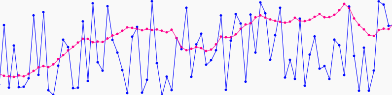

# Randomness

When creating generative design, you are thinking about the balance between control and chaos. If you control everything perfectly every time, your result will always be the same. If you completely rely on the randomness, then you are not really doing anything. Interesting things can happen when you start controlling some aspect while loosening up other aspects at the same time. For example, you can create a variable and limit its minimum and maximum values.

## Random function
p5 has `random()` function that will give you a random number. When you give a single parameter, you set the maximum number it may return, and the two parameters for minimum and maximum number.

```js
function draw() {
  var r = random(20);
  console.log( r ); // a random number between 0 and 20
}
```
```js
function draw() {
  var r = random(10, 20);
  console.log( r ); // a random number between 10 and 20
}
```
It is just a number that `random()` returns. It is up to you however you want to use that number.

If you don't like getting a random number every frame, which makes your color or shape go crazy every frame, then, you can get a random number in `setup()` once at the beginning, store it int a variable and keep using it in `draw()`:

```js
var col1;
var col2;

function setup() {
  createCanvas(600, 600);
  col1 = color( random(200), random(100), random(100, 200) );
  col2 = color( random(50,100), random(200), 0 );
}

function draw() {
  background(col1);
  fill(col2);
  rect(50, 50, 100, 100);
}
```

## Noise
While `random()` value does not have any relationship between the current and previous values, `noise()` does have relationship among values returned from it. 

The value returned from `noise()` is always between 0 and 1. You cannot set the range, so you will have to do a little bit of arithmetic to get the range you want.

```js
function draw() {
  background(200);
  
  var x = noise(frameCount/100)*width; // the range between 0 and width
  ellipse(x, height/2, 100, 100);
}
```


## Comparing random and noise
Let's try to visualize the difference between random and noise in a different way. The example below shows how the value changes over time using `random()` and `noise()`, respectively.
```js
var x = 0; // x (keep increasing)
var ry = 0; // random y
var ny = 0; // noise y
var px = x; // previous x
var pry = ry; // previous random y
var pny = ny; // previous noise y

function setup() {
  createCanvas(800, 200);
  background(250);
  frameRate(15);
}

function draw() {
  
  ry = random(0, height);
  
  fill(0, 0, 255);
  stroke(0, 0, 255);
  ellipse(x, ry, 4, 4);
  line(px, pry, x, ry);
  
  ny = noise(x/100)*height;
  fill(255, 0, 150);
  stroke(255, 0, 150);
  ellipse(x, ny, 4, 4);
  line(px, pny, x, ny);
  
  px = x;
  pry = ry;
  pny = ny;
  x += 10;
}

function mousePressed() {
  background(250);
  x = 0;
  px = x;
}
```



-----
*Exercise: Go back to some of your old sketches and try using `random()` and `noise()` in different situations. Play with their parameters to get a feel for it.*

*Exercise: Once you feel comfortable using the two functions, apply them to your own design and start controlling typographic properties. Repeat adjusting the values until you are happy with the results.*
