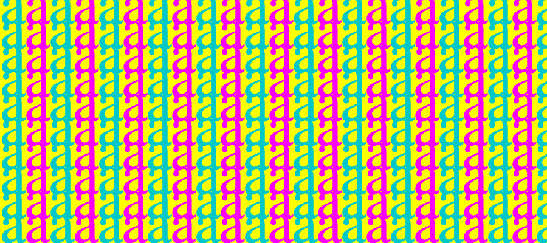

# Typographic Patterns

## 1 dimensional pattern

```java
PFont font;

void setup() {
  size(600, 200);
  font = createFont("SansSerif", 120);
  textFont(font);
  textAlign(CENTER, BASELINE);
  background(200);
}

void draw() {
}

void keyPressed() {
  background(200);
  for (int i = 0; i < 40; i++) {
    fill(random(150, 255), 50, 200);
    text(key, -30 + i * 30, height/4*3 );
  }
}
```

*Exercise: How about text size increasing/decreasing inside the for loop? What other things can you control within the loop?*

## 2 dimensional pattern
```js
PFont font;
char t;

void setup() {
  size(600, 600);
  font = createFont("Serif", 96);
  textFont(font);
}

void draw() {
  background(255, 255, 0);

  for (int i = 0; i <= width; i += 40) {
    for (int j = 0; j <= height; j += 40) {
      if (i % 80 == 0) {
        fill(0, 200, 200);
      } else {
        fill(250, 0, 250);
      }
      text(t, i, j);
    }
  }
}

void keyTyped() {
  t = key;
}
```

*Exercise: Identify which number controls the spacing between each letter. Then, control the spacing with mouse position. Do note that you may run into an infinite loop when mouse position is at `0`. You must avoid that!*

## Brick pattern
Notice that, for the transformations to happen on each letter, we have to use transformation functions within `push()` and `pop()`.

```js
float scaleFactor;
String t = "g";

void setup() {
  	size(800, 600);
	textFont("Serif");
	textAlign(CENTER, CENTER);
}

void draw() {
  background(255);

  int xspacing = 60;
  int yspacing = 40;
  scaleFactor = map(mouseX, 0, width, 0.2, 4);
  int xcount = 0;
  int ycount = 0;
  
  for (int y = 0; y <= height; y += yspacing) {
    for (int x = 0; x <= width; x += xspacing) {
      pushMatrix();
      // every other row
      if (ycount % 2 == 0) {
        translate(x, y);
        rotate(frameCount/200.0);
      } else {
        translate(x - xspacing/2, y);
        rotate(-frameCount/200.0);
      }
      if (xcount % 2 == 0) {
				fill(100, 200, 255);
			} else {
				fill(250, 100, 250);
			} 
			textSize(40 * scaleFactor);
      text(t, 0, 0);
      popMatrix();

      xcount++;
    }
    ycount++;
  }
}

void keyTyped() {
	t = key;
}
```

## Circular pattern

```js
String s1 = "꽃";
String s2 = "잎";

void setup() {
  size(600, 600);
  colorMode(HSB, 360, 100, 100, 100);

  textFont("SansSerif");
  textSize(80);
  textAlign(LEFT, BOTTOM);
}

void draw() {
  background(0, 0, 100);
  fill(0);
  
  float offset1 = map(mouseX, 0, width, -100, 100);
  float offset2 = map(mouseY, 0, height, -100, 100);

  for (int i = 0; i < 360; i += 30) {
    pushMatrix();
    translate(width/2, height/2);
    rotate( radians(i) );
    fill(300, 60, 100);
    text(s1, offset1, offset2);
    fill(140, 100, 100);
    text(s2, offset2, offset1);
    popMatrix();
  }
}
```

------

*Exercise: Practice creating 1d & 2d patterns with for loops. Map some of the properties to mouse positions, such as spacing, text size, color, rotation, etc.*

*Exercise: Instead of treating letters as pattern units, how about typing each key to create different visual patterns?*
