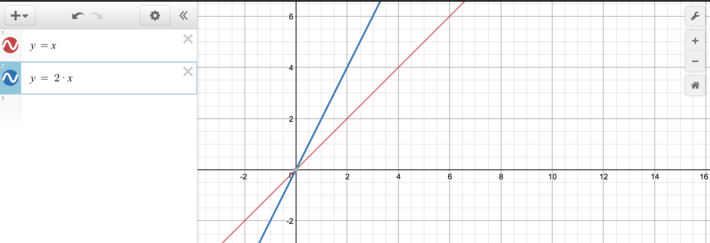

# Interpolation


## Graphing
Imagine yourself back in a middle school math classroom. Your teacher asked to plot a graph *y = x* and *y = 2x*. This is what you will draw:



To apply this graph to motion, think of *x* axis as time, and *y* axis as value you get over time. That's basically what we did in the last posting.
```js
xpos += 1;
```
```js
xpos += 3;
```
```js
xpos = frameCount;
```
`xpos` is increased by the set amount every frame. It is a *linear* movement. If we can cook the value of the right-hand side of the eqution, we can come up with all kinds of motion.


- get the distance in terms of x and y

- range from 0 to 1.

- move by increments

- exponential

- s surve (easing in and out)


## Linear interpolation
- coding math videos
- desmos
- normalize
- map
- lerp

## Acceleration
